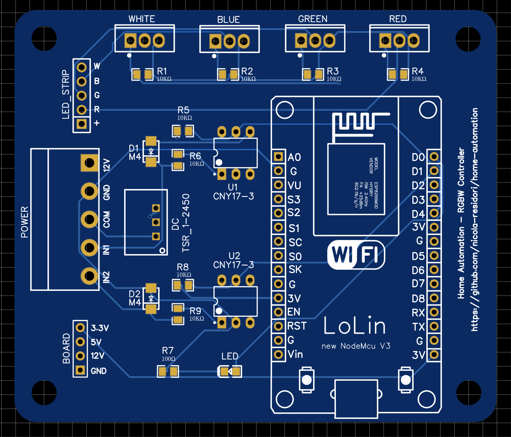

RGBWController - led strip controller
===================================

# What is `RGBWController`?
It's a board to automate and control an RGBW led strip, based on NodeMcu-LoLin V3.  
## :warning: Warnings
This board is prototype, not a product.
Consider to use it for test and learning mechanism.  
I advise the reader that I'm not responsible for the usage and every damages that may occur using and building the board.
## Description
The RGBWController can control colors, fade and dimmer of a rgbw 12v led strip directly using 2 push buttons or using mqtt protocol to automate it with most important home automation system like (HomeKit, Alexa, GoogleHome and so on).
## Schematic

To update or visit the Board project you can use [EasyEDA](https://easyeda.com) software and load [EasyEda_Project.zip](EasyEda_Project.zip) file.
## PCB
 
## Components
* [NodeMCU Lolin V3](https://www.amazon.it/AZDelivery-NodeMCU-V3-Lolin-Parent/dp/B08171RV5R): to weld on top layer over NodeMCU serigraphy (suggested to weld 2 lines of strip in order to connect LoLin pins).
* [IRZ44N](./document/IRLZ44n.pdf) x 4: to weld on top layer over WHITE, BLUE, GREEN and RED serigraphy.
* 10KΩ SMD-0805 resistors x 8: to weld on top layer over R1, R2, R3, R4, R5, R6, R8 and R9 serigraphy.
* 100Ω SMD-0805 resistors x 1: to weld on top layer over R7 serigraphy.
* M4 SMD-Diode x 2: to weld on top layer over D1 and D2.
* Led SMD-0805: to weld on top layer over LED serigraphy.
* [CNY17-3 x 2](./document/CNY17-3.pdf): to weld on top layer over U1 and U2.
* [TSR_1-2450](./document/TSR_1-2450.pdf): to weld on top layer over DC.
* male pin connectors x 2 for LED_STRIP and BOARD.
* Pin Connector for POWER.
## How to build?
You can go on [JLCPCB](https://jlcpcb.com) site to build the PCB board uploading [BoardPCB_Gerber.zip](BoardPCB_Gerber.zip) file.
You can also buy the weld components service in the same site or proceed to weld by your self.
# Tasmota, how to configure?
[Tasmota](https://tasmota.github.io/docs/) is an open source firmware for ESP devices, you can flash the NodeMcu with a build of Tasmota and configure it to manage LoLin functionalities.
## Installation
* Connect the NodeMcu to the computer with micro-usb cable, if it is necessary visit [NodeMCU drivers](https://github.com/nodemcu/nodemcu-devkit/tree/master/Drivers) for the drivers.
* Open [Tasmota Installer](https://tasmota.github.io/install/) site.
* Select **ESP32** in the right ListBox and click on **Connect**.
    
* Select the correct serial port for the usb connection
* If another dialog appear select **INSTALL RELEASE TASMOTA**
* On the next page check **Erase Driver** and go **Next**
* Wait till installation complete.  

Tasmota is now installed, and after device restart it should expose a new Wi-Fi Network SSID like Tasmota-XXX-XXX.  
Connect to this free Wi-Fi, a popup should appear with the Wi-Fi local network configuration.  
Select your local Wi-Fi, write Password and click on **SAVE**.
The device will restart and after that it will be connected to your network.
## Configuration
* Open the browser and go to the IP of your device.
* Write following Template:  
  `{"NAME":"rgbw-controller","GPIO":[0,0,160,0,0,161,0,0,418,417,419,416,544,0],"FLAG":0,"BASE":18}`
### MQTT Configuration

## Scripts
On the console write following commands:
  ``` shell
  Backlog LedTable; SwitchMode1 12; SwitchMode2 12; SetOption32 10; SetOption105 1; Rule1 1;
  ```
  ``` shell
  Rule1 
  on system#boot do Backlog var1 +; var2 50; var3 FF000000 ENDON
  on switch1#state=2 do POWER TOGGLE ENDON
  on switch1#state=4 do DIMMER %var1% ENDON
  on switch1#state=7 do event upordown=%var1% ENDON
  on event#upordown=+ do var1 - ENDON
  on event#upordown=- do var1 + ENDON
  on dimmer#state do var2 %value% ENDON
  on switch2#state=2 do WHITE %var2% ENDON
  on switch2#state=4 do event colorchange=%var3% ENDON
  on event#colorchange=FF000000 do Backlog color %var3%; var3 FFFF0000 ENDON
  on event#colorchange=FFFF0000 do Backlog color %var3%; var3 00FF0000 ENDON
  on event#colorchange=00FF0000 do Backlog color %var3%; var3 00FFFF00 ENDON
  on event#colorchange=00FFFF00 do Backlog color %var3%; var3 0000FF00 ENDON
  on event#colorchange=0000FF00 do Backlog color %var3%; var3 FF000000 ENDON
  ```
# HomeBridge, how to configure?
For installation the suggestion is to visit official [HomeBridge](https://homebridge.io) site.
## Plugin
The plugin to install for this device is [homebridge-sonoff-tasmota-mqtt-hsb](https://github.com/matt-downs/homebridge-sonoff-tasmota-mqtt-hsb).
The configuration is the following
``` javascript
    {
        "accessory": "sonoff-tasmota-mqtt-hsb",
        "name": "$name_to_see_on_home_app$",
        "url": "$url_of_mqtt_server$",
        "username": "$mqtt_user$",
        "password": "$mqtt_user_password$",
        "caption": "<label>",
        "topics": {
            "setOn": "cmnd/$mqtt_service$/Power",
            "setHsb": "cmnd/$mqtt_service$/HSBColor",
            "status": "stat/$mqtt_service$/RESULT"
        }
    }
```